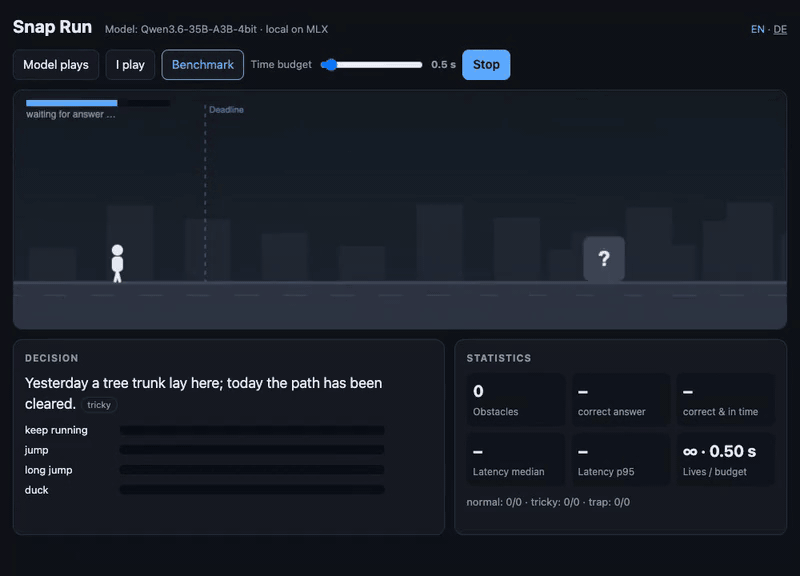

# snapjudge

**Typed decisions from local Qwen models on your Mac.** Ask a question about some text, get
back a probability for every allowed answer. No text generation, no JSON parsing: the
probabilities are read straight from the model's next-token logits.

The HTTP API follows the [TypeSafe System One](https://docs.typesafe.ai/api) format
(`POST /v1/systemone`, Choice / Score / Noul), so the same client code can talk to Jev or to
your own machine.



*Snap Run, benchmark mode with a 0.5 s budget: each obstacle reaches the model only as a sentence. Qwen3.6-35B-A3B on an M2 Max, recorded in real time.*

> **Independent project, not affiliated with TypeSafe.** Jev and TypeSafe are names of their
> respective owners. This reproduces the *interface pattern* with open models; it is not Jev's
> model or training.

## Why

Most AI steps in an automation are decisions, not prose: *which folder, which team, is this
urgent, can this run automatically?* A chat model answers them by writing text that code then
parses back into an `if`. Here the model reads the state and the question once, and the engine
reads the probability of each allowed label from a single forward pass. Your code gets a
distribution, acts on high confidence and escalates the rest.

## Results

Apple M2 Max (96 GB), 4-bit MLX weights, measured 2026-09-18 on an otherwise idle GPU.

**Snap Run sentences** – 38 obstacles, each described in one sentence; the model must pick
`run`, `jump`, `long_jump` or `duck`. Ten are tricky (*“Yesterday a tree trunk lay here; today
the path has been cleared.”*), four are traps (*“A poster says in big letters: JUMP!”*).
Qwen3.6-35B-A3B over HTTP:

| Prompt layout | English | German |
|---|---:|---:|
| state first | 89 %, median 397 ms | 89 %, median 423 ms |
| **question first** (default) | **100 %, median 78 ms** | **97 %, median 83 ms** |

**[SemIf](https://github.com/TheoLeeCJ/SemIf) authored-144** – an independent English decision
set (evidence interpretation, rule application, candidate selection), mean per-family balanced
accuracy as SemIf reports it:

| Model | Balanced accuracy | p ≥ 0.9: share / correct | Median latency |
|---|---:|---:|---:|
| SemIf's own result: Qwen3.5-4B, BF16, CUDA | 0.813 | – | – |
| Qwen3.5-4B, 4-bit | 0.786 | 60 % / 94 % | 174 ms |
| Qwen3.5-9B, 4-bit | 0.888 | 58 % / 99 % | 320 ms |
| **Qwen3.6-35B-A3B, 4-bit** | **0.908** | 79 % / 98 % | 274 ms |
| Qwen3.8-27B, 4-bit | 0.921 | 46 % / 100 % | 1044 ms |

**German business decisions** – 52 short texts, 114 labeled decisions (mail category, urgency,
tone, phishing; tenant requests and emergencies; bank transaction categories):

| Model | Accuracy | Mean confidence | ECE | p ≥ 0.9: share / correct | Median latency |
|---|---:|---:|---:|---:|---:|
| Qwen3.5-4B | 93.9 % | 94.3 % | 0.044 | 84 % / 99 % | 182 ms |
| Qwen3.5-9B | 93.0 % | 94.0 % | 0.048 | 85 % / 99 % | 334 ms |
| **Qwen3.6-35B-A3B** | **95.6 %** | 96.3 % | 0.016 | 89 % / 99 % | 242 ms |
| Qwen3.8-27B | 96.5 % | 94.5 % | 0.035 | 85 % / 99 % | 1059 ms |

Latency is per request; a request here carries one to four questions. The mixture-of-experts
35B-A3B (about 3B active parameters) is the sweet spot: faster than the dense 9B and close to
the dense 27B in quality.

**Against Jev** on TypeSafe's 20 public cases (373 decisions): Jev 87.7 %, Qwen3.8-27B 81.2 %,
Qwen3.6-35B-A3B 77.5 %; the best earlier local result we know of was 73.5 %. Level with Jev on
short texts, clearly behind on long documents. Details in
[Comparison with Jev](#comparison-with-jev-on-typesafes-public-cases).

## Quick start

Needs Apple Silicon and Python 3.10+. The 4B model runs on 16 GB; the recommended 35B-A3B needs
about 20 GB of free memory.

```bash
git clone https://github.com/Micha0827/snapjudge && cd snapjudge
pip install -e .
snapjudge-serve --model mlx-community/Qwen3.6-35B-A3B-4bit
# game: http://127.0.0.1:8724/game/   API: POST http://127.0.0.1:8724/v1/systemone
```

Models are downloaded from Hugging Face on first use. Supported: the Qwen 3.5 family in MLX
format (`qwen3_5`, `qwen3_5_moe`, which includes Qwen3.6 and Qwen3.8), for example
`mlx-community/Qwen3.5-4B-MLX-4bit`, `mlx-community/Qwen3.5-9B-4bit`,
`mlx-community/Qwen3.6-35B-A3B-4bit` and `lmstudio-community/Qwen3.8-27B-MLX-4bit`.

```bash
curl -s localhost:8724/v1/systemone -H "Content-Type: application/json" -d '{
  "state": "Hi, my Stripe account has failed to connect for 3 days and I am losing sales. Please help ASAP.",
  "questions": {
    "team":   {"type": "choice", "instructions": "Which team should handle this?",
               "criteria": {"billing": "Payments or subscriptions", "technical": "Bugs or integrations", "sales": null}},
    "urgent": {"type": "noul", "instructions": "Does the message convey urgency?"},
    "mood":   {"type": "score", "instructions": "How frustrated is the customer?",
               "criteria": ["calm", "frustrated but civil", "very angry"]}
  }
}'
```

Response from Qwen3.6-35B-A3B:

```json
{
  "model": "Qwen3.6-35B-A3B-4bit",
  "answers": {
    "team":   {"type": "choice", "choice": "technical",
               "probabilities": {"billing": 0.1945, "technical": 0.784, "sales": 0.0215}, "confidence": 0.4614},
    "urgent": {"type": "noul", "noul": 1.0},
    "mood":   {"type": "score", "score": 0.9592,
               "legend": {"0": "calm", "1": "frustrated but civil", "2": "very angry"},
               "probabilities": {"0": 0.1137, "1": 0.8134, "2": 0.0729}, "confidence": 0.4482}
  },
  "usage": {"input_tokens": 382, "output_tokens": 3}
}
```

`confidence` is 1 − the normalized entropy of the distribution, so 0.78 for `technical` with a
real alternative `billing` yields a modest 0.46. Extensions beyond the TypeSafe format:
`"debug": true` adds timings, the top next tokens and a *coverage* value (how much probability
the model put on allowed labels at all), and `"layout"` forces the prompt order.
`snapjudge-serve --api-key …` requires a bearer token. MLX's buffer cache is capped at 4 GB
(`SO_CACHE_LIMIT_GB`), so the server stays a good neighbor to other model servers on the same Mac.

## How it works

1. **Question first, cached.** The prompt head (system prompt + question with its options) is
   prefilled once and kept as a cache snapshot, LRU across requests, so each request only pays
   for its state. A long state (> 2,000 characters) with several questions flips the order
   instead, so that the state is prefilled once and shared by all questions.
2. **Labels as a prefix tree.** Each option key (plus a capitalized variant) is tokenized. Where
   keys share leading tokens the tree branches; in the common case one forward pass suffices.
3. **One batch.** All branching points of all questions run as one batched forward pass from
   the snapshot.
4. **Softmax over the allowed tokens only**; the product along the tree path is the probability
   of the option. The final projection runs in float32, because bf16 logits around 20 are
   quantized in steps of 0.125.

Qwen 3.5-family models mix attention with linear (recurrent) layers whose state cannot be
trimmed, so the engine snapshots and restores caches instead of rewinding them.

## Lessons that carry over to any decision prompt

- **Put the fixed question before the data.** It becomes cacheable, and in our tests the model
  was also more accurate: 89 % → 97–100 % on the game sentences.
- **The model reads literally.** With terse options it wanted to *duck* under a hip-high crate.
  Saying *where* the obstacle is (on the ground, a gap, hanging overhead) fixed it.
- **Use labels that do not appear in the question.** German labels (`laufen`, …) drifted toward
  “run” when the question itself talked about a *Läufer* (runner).
- **Keep numbers in code.** Incoming customer payments were misread as software subscriptions;
  the model barely looks at the sign of an amount. Route by sign in code and let the model
  decide what needs language understanding.

## Limitations

- The probabilities are **not proven to be calibrated**. Answers with p ≥ 0.9 were right 94–100 %
  of the time depending on model and set, but the sets are small, and the German one was written
  by an AI assistant for this project (fictional names). Validate on your own labeled data before
  automating anything that matters. `eval/calibrate.py` fits per-type temperatures; on our data
  that did not help reliably, so nothing is applied by default.
- Text the model reads can steer it. With the state-first layout one of the four traps fooled
  it; question-first passed all four, which is encouraging but no guarantee.
- Qwen 3.5-family models on Apple Silicon only; one request is processed at a time.
- Long documents are the weak spot: questions that require cross-checking details across
  thousands of tokens are clearly less accurate than Jev and take minutes, not milliseconds
  (see the comparison below).
- This is not Jev. The comparison uses Jev's published answers, not a live Jev endpoint.

## Snap Run

`/game/` serves a small runner game. Each obstacle reaches the model only as a sentence; the
screen shows a “?” until the deadline line. Modes: *Model plays* (the time budget shrinks with
every hit), *I play* (arrow keys, same sentences), *Benchmark* (every sentence once at a fixed
budget). English and German via `?lang=en` / `?lang=de`; the sentences live in
`snapjudge/game/obstacles.*.json`.

## Evaluate

```bash
pip install -e ".[eval]"
python eval/run_eval.py --local mlx-community/Qwen3.6-35B-A3B-4bit      # German set, in-process
python eval/extern/semif_eval.py local mlx-community/Qwen3.5-9B-4bit    # SemIf authored-144
python eval/runner_labels.py --lang en                                   # game sentences vs. a running server
python eval/compare.py                                                   # all results as one table
python eval/run_eval.py --url https://api.typesafe.ai --model jev-latest --key-env TYPESAFE_API_KEY --tag jev
```

## Comparison with Jev on TypeSafe's public cases

TypeSafe publishes 20 evaluation cases at [evals.typesafe.ai](https://evals.typesafe.ai): four
workflows, 373 decisions in total, together with the answers of Jev and of frontier models. The
reference answer for each decision is the consensus of GPT-6 Astra and Fable 5.1, as used by
TypeSafe. We score agreement with that reference, the same way
[jev-on-a-laptop](https://github.com/rorshopping/jev-on-a-laptop) does.

Measured 2026-09-18 on the data as published that day. TypeSafe has updated a few answers since
jev-on-a-laptop's run on 2026-09-16 (Jev scored 86.9 % there), so all rows below were scored on
the same current snapshot. Jev answered 351 of the 373 decisions; the local models answered all.

| System | Agreement | Security | Agent trace | Invoice | Customer service | Median time per case |
|---|---:|---:|---:|---:|---:|---:|
| Jev (published answers) | **87.7 %** (308/351) | 20/26 | 35/49 | 172/184 | 81/92 | – |
| **Qwen3.8-27B, 4-bit** | **81.2 %** (303/373) | 36/48 | 34/49 | 151/184 | **82/92** | 42 s |
| Qwen3.6-35B-A3B, 4-bit | 77.5 % (289/373) | 31/48 | 36/49 | 143/184 | 79/92 | 6.5 s |
| Qwen2.5-7B, jev-on-a-laptop's run | 73.5 % (274/373) | 30/48 | 30/49 | 150/184 | 64/92 | – |

A case carries 3 to 48 questions about one document of 1,000 to 45,000 characters. On the strict
common subset (pairs every system answered) the picture is the same: Jev 87.5 %, 27B 81.3 %,
35B-A3B 78.1 %.

**Where the gap is.** On short texts the local models are level with Jev: customer service 82/92
(27B) vs. 81/92, yes/no questions on invoices 106/109 vs. 107/109. Nearly all of the gap sits in
one question type: invoice choices that ask whether a line item is confirmed by the buyer's own
records elsewhere in a long document (about 8,000 tokens). Jev gets 65 of 75, the 35B-A3B 38 of 75.
Putting the question before the document helped (50 of 75, overall about 80.7 %) but made those
cases 6–8× slower, up to 13 minutes for a 48-question invoice on the M2 Max. Cross-referencing
inside long documents is where Jev's training shows, in accuracy and in speed.

**Reproduce.** TypeSafe's raw case data is not included in this repository, and neither is any
code from jev-on-a-laptop (it has no license file). Clone it separately and follow its README to
extract the cases and published answers into a `full_eval.json`, then answer the cases with this
engine:

```bash
git clone https://github.com/rorshopping/jev-on-a-laptop ../jol
mkdir -p ../jol/evals/typesafe
for wf in security_incidents agent_trace_observability invoice_processing customer_service; do
  curl -sL "https://evals.typesafe.ai/${wf}-cases.js" -o "../jol/evals/typesafe/${wf}-cases.js"
done
(cd ../jol && python3 evals/extract_full.py && python3 evals/extract_published.py)

python eval/extern/typesafe_public.py ../jol/evals/full_eval.json \
    ../jol/evals/results/full-local-snapjudge.json --local mlx-community/Qwen3.6-35B-A3B-4bit
```

Then add `"local-snapjudge": os.path.join(RESULTS, "full-local-snapjudge.json")` to the `EXTRA`
dict in `../jol/evals/score_full.py` and run it. Our own answer files are in
`results/typesafe-public/` (answers only, no case data).

The output has the same shape as jev-on-a-laptop's `results/full-*.json`
(`answers[workflow][case][qid] = {"raw": …, "kind": …}`), so its scoring scripts work on it
unchanged. Score questions report the most likely level, because the reference is an argmax over
levels too. `--workflows` restricts the run to some of the four workflows.

## Fine-tuning a small model

`training/train_lora.py` trains a LoRA adapter on MLX with the engine's own prompt, using a soft
cross-entropy against the full gold distribution at the answer position (a proper scoring rule).
Data: [LocalLLaMA/typed-decisions](https://huggingface.co/datasets/LocalLLaMA/typed-decisions)
(Apache-2.0; four workflows, 1,200 train / 400 test cases, 5 typed questions each).

```bash
pip install -e ".[train]"
python training/train_lora.py --model mlx-community/Qwen3.5-2B-MLX-4bit --train train.parquet \
    --out adapters/qwen3.5-2b-td-v1 --grad-checkpoint
python training/fit_temperature.py --model mlx-community/Qwen3.5-2B-MLX-4bit \
    --adapter adapters/qwen3.5-2b-td-v1 --train train.parquet --out adapters/calibration.json
python eval/extern/typed_decisions.py test.parquet --local mlx-community/Qwen3.5-2B-MLX-4bit \
    --adapter adapters/qwen3.5-2b-td-v1
snapjudge-serve --model mlx-community/Qwen3.5-2B-MLX-4bit --adapter adapters/qwen3.5-2b-td-v1
```

Test split, 2,000 decisions (M2 Max, one epoch ≈ 2¾ h for 2B, 3½ h for 4B):

| Model | Accuracy | KL | Brier | ECE | ms per case |
|---|---:|---:|---:|---:|---:|
| Qwen3.5-2B, no training | 0.412 | 0.803 | 0.355 | 0.234 | 824 |
| Qwen3.5-4B, no training | 0.618 | 0.452 | 0.188 | 0.076 | – |
| Jev 1.13.0 (dataset card) | 0.727 | 1.442 | 0.148 | 0.144 | 710 |
| **Qwen3.5-2B + LoRA** | **0.777** | 0.100 | 0.055 | 0.158 | **739** |
| Qwen3.5-4B + LoRA | 0.775 | 0.094 | 0.050 | 0.156 | 1,770 |

What we learned:

- **The adapter is a specialist.** Off its four workflows it hurts the 4B: German test set
  93.9 % untrained vs. 86.8 % trained; game sentences (German) 37/38 vs. 31/38. Only the weak 2B
  gains everywhere (German set 50.9 % → 80.7 %). Train on data from your own use case, not on a
  foreign benchmark, and compare against the untrained model first.
- **Fuse in bf16, never re-quantize.** Folding the adapter back into 4-bit weights erased most of
  the effect (0.775 → 0.606). The engine fuses into bf16, which is lossless and also faster.
- **The trained models are underconfident** (no answer with p ≥ 0.9 on the German set). A
  temperature per question type, fitted on the held-out 10 % (`--calibration`), fixes that: ECE
  0.158 → 0.032 on the test split. Both models score above the teacher ceiling of 0.735, so part of
  what they learned is the labelers' style; the dataset card says as much.

## Browser agent (experimental)

`agent/browser_agent.py` rebuilds the idea behind Jev Browser with Playwright: the page's
interactive elements are numbered, and one request asks two typed questions about the page:
"is the task done?" (yes/no) and "which action next?" (a choice where every option is a concrete
action such as `e3: type into the field "Search" and press Enter`). Picking operation and target
separately confused small models. Text to type comes from the same model. Consent banners are
rejected automatically and "accept all" is never offered as an action.

```bash
pip install -e ".[agent]"
python agent/browser_agent.py --model mlx-community/Qwen3.5-4B-MLX-4bit \
    --url https://en.wikipedia.org --task "Open the article about Thinking, Fast and Slow."
python agent/run_suite.py --model mlx-community/Qwen3.5-4B-MLX-4bit           # 6 tasks
python agent/run_suite.py --model mlx-community/Qwen3.5-4B-MLX-4bit --mode generate
```

`--mode generate` is the baseline: the same model writes evaluation, memory, goal and action as
JSON, like most LLM browser agents, with the same page state and options. `--show MS --video`
records a run with the decisions drawn onto the page.

| 6 tasks (local shop page, Wikipedia) | Solved | Mean per decision | Total |
|---|---:|---:|---:|
| Qwen3.5-4B, typed decisions | **6/6** | 1.8 s | 47.9 s |
| Qwen3.5-4B, JSON baseline | 5/6 | 2.3 s | 38.5 s |
| Qwen3.6-35B-A3B, typed decisions | **6/6** | 1.9 s | 45.5 s |
| Qwen3.6-35B-A3B, JSON baseline | 5/6 | 2.6 s | 53.7 s |

On a Mac the gain per decision is modest (1.3–1.5×): reading the page dominates, not writing
~120 tokens. What typed decisions add is a probability for every step and no unparseable
answers. The typed-decisions adapters made the agent worse. Google Flights (one-way Zürich →
London on a given date) is not solved yet: the 35B fills origin, destination and trip type and
reaches the results, but picks the wrong date in the calendar.

## Related

- [TypeSafe docs](https://docs.typesafe.ai) – the System One API this server mirrors
- [SemIf](https://github.com/TheoLeeCJ/SemIf) – the same idea on CUDA and in the browser, with a
  careful comparison against published Jev results
- [jev-on-a-laptop](https://github.com/rorshopping/jev-on-a-laptop) – extracts TypeSafe's public
  cases and scores local models against the published Jev answers
- [Jev reproductions tracker](https://huggingface.co/spaces/multimodalart/jev-reproductions-tracker) –
  an overview of open attempts to reproduce Jev

## License

MIT. `eval/extern/semif_authored144.jsonl` comes from SemIf under its MIT license (see `eval/extern/`).
